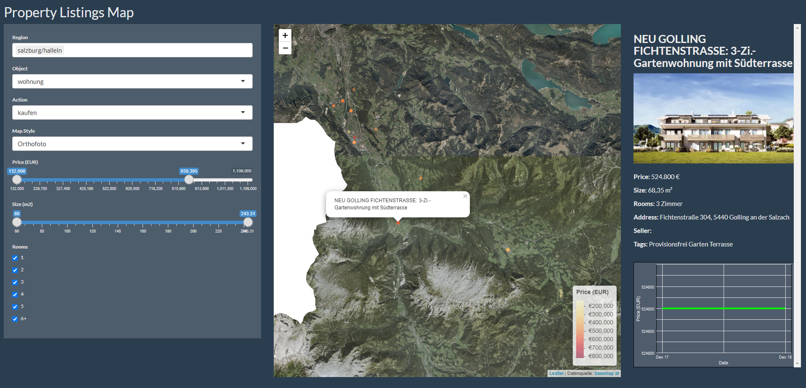

# Property Listings Map Viewer



## Overview
This Shiny application provides an interactive map to visualize property listings. Users can filter properties based on criteria like region, type, action, and more. The app displays detailed information and price trends for each property.

## Features
- Interactive map to display property listings.
- Filters for region, object type, action, price, size, and number of rooms.
- Detailed property information including images and price trends.

## Getting Started

### Prerequisites
- R and RStudio
- Required libraries: shiny, dplyr, ggplot2, leaflet, shinythemes

### Installation
1. Clone the repository or download the R script (`app.R`).
2. Ensure you have the required libraries installed. You can install them using R commands like `install.packages("shiny")`.

### Data Source
- The application requires a CSV file named `houses.csv` with property data.
- Make sure the CSV file is in the same directory as the R script.

### Running the Application
1. Open `app.R` in RStudio.
2. Set the working directory to the directory containing `app.R`.
3. Run the application in RStudio by clicking 'Run App'.

### Restoring Virtual Environment
To restore the virtual environment and ensure the right package versions are used, follow these steps:
1. Make sure you have `renv` installed. If not, install it using `install.packages("renv")`.
2. Use the `renv.lock` file to restore the environment:
   ```R
   renv::restore()
   ```

## Contributing
Feel free to fork the repository and submit pull requests.

## License
This project is licensed under the MIT License - see the LICENSE file for details.
